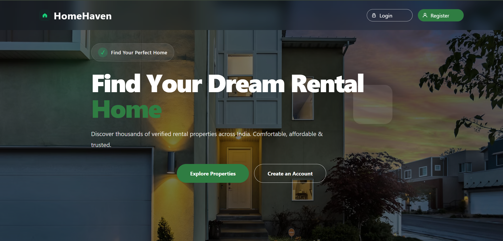
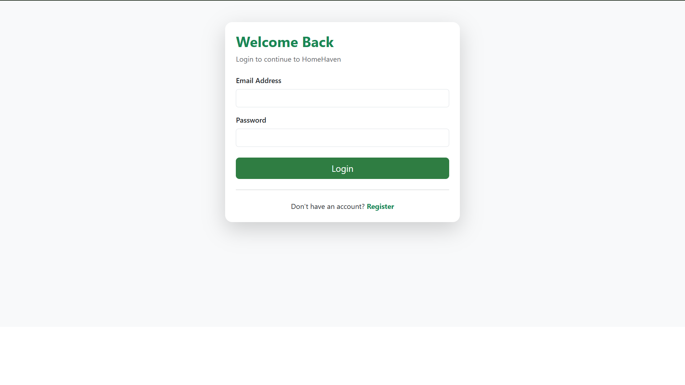
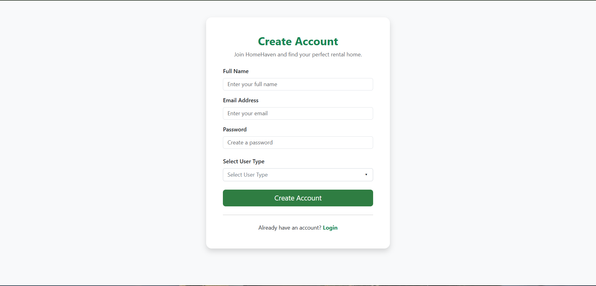
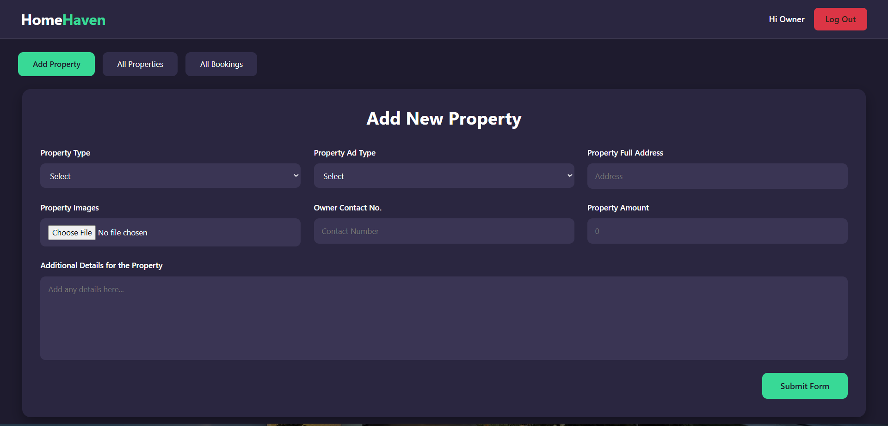

# 🏠 HomeHaven – House Rent Management System

HomeHaven is a full-stack MERN (MongoDB, Express.js, React.js, Node.js) web application that allows property owners to list rental properties and renters to browse, book, and manage rental homes. The application features secure authentication, cloud-based image storage using Cloudinary, responsive design, and an intuitive user experience.

---

## 🚀 Live Demo

### 🌐 Frontend (Vercel)
https://your-vercel-url.vercel.app

### ⚙️ Backend (Render)
https://homehaven-house-rent-management-system.onrender.com

---

## ✨ Features

### 👤 User Authentication
- User Registration
- User Login
- JWT Authentication
- Protected Routes

### 🏡 Property Management
- Add Property
- Edit Property
- Delete Property
- View All Properties
- View Owner Properties
- Property Details Page

### 📅 Booking System
- Book a Property
- Cancel Booking
- Booking Management
- Property Availability Status

### 🖼 Cloud Image Upload
- Upload Images using Cloudinary
- Permanent Cloud Storage
- Property Image Preview

### 🎨 User Interface
- Responsive Design
- Bootstrap 5
- Glassmorphism Cards
- Toast Notifications

---

## 🛠 Tech Stack

### Frontend
- React.js
- React Router DOM
- Axios
- Bootstrap 5
- React Toastify

### Backend
- Node.js
- Express.js
- MongoDB Atlas
- Mongoose
- JWT Authentication
- Multer
- Cloudinary
- Multer Storage Cloudinary

### Deployment
- Frontend – Vercel
- Backend – Render
- Database – MongoDB Atlas
- Image Storage – Cloudinary

---

## 📁 Project Structure

```text
HomeHaven/
│
├── client/
│   ├── public/
│   ├── src/
│   └── package.json
│
├── server/
│   ├── config/
│   ├── controllers/
│   ├── middleware/
│   ├── models/
│   ├── routes/
│   ├── uploads/
│   ├── server.js
│   ├── package.json
│   └── .env.example
│
├── screenshots/
│   ├── home.png
│   ├── login.png
│   ├── register.png
│   ├── owner-dashboard.png
│   ├── property-details.png
│   └── booking-page.png
│
└── README.md
```

---

## ⚙️ Installation

### Clone the Repository

```bash
git clone https://github.com/your-username/HomeHaven.git
```

### Install Frontend Dependencies

```bash
cd client
npm install
```

### Install Backend Dependencies

```bash
cd ../server
npm install
```

---

## 🔑 Environment Variables

Create a `.env` file inside the **server** folder.

```env
PORT=5000

MONGO_URI=your_mongodb_connection_string

JWT_SECRET=your_jwt_secret

CLOUDINARY_CLOUD_NAME=your_cloud_name
CLOUDINARY_API_KEY=your_api_key
CLOUDINARY_API_SECRET=your_api_secret
```

---

## ▶️ Running the Project

### Start Backend

```bash
cd server
npm run dev
```

### Start Frontend

```bash
cd client
npm start
```

---

## 📷 Screenshots

### 🏠 Home Page



---

### 🔐 Login Page



---

### 📝 Register Page



---

### 👨‍💼 Owner Dashboard



---

### 🏡 Property Details


---

### 📅 Booking Page


---

## 🌟 Future Enhancements

- Advanced Property Search & Filters
- Wishlist / Favorites
- Google Maps Integration
- Online Payment Gateway
- Email Notifications
- User Profile Management
- Property Reviews & Ratings
- Admin Analytics Dashboard

---

## 👥 Project Team

This project was collaboratively developed by the following team members.

| Name | Role | GitHub | LinkedIn |
|------|------|--------|----------|


---

## 🤝 Contributing

Contributions, suggestions, and improvements are welcome. Feel free to fork this repository and submit a pull request.

---

## 📄 License

This project was developed for educational and learning purposes.